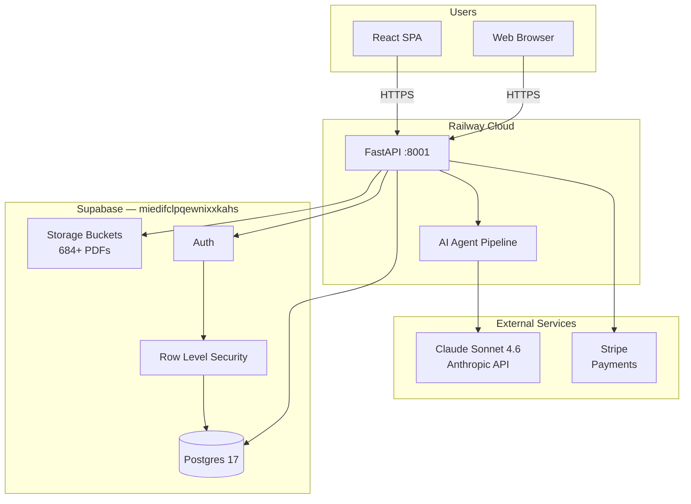
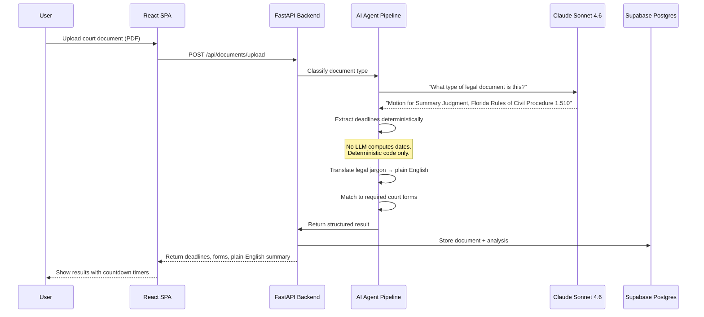
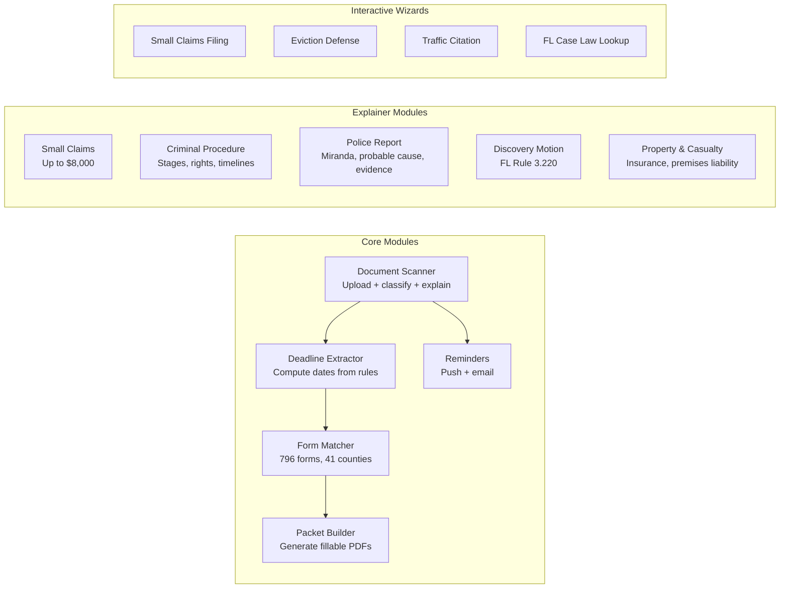
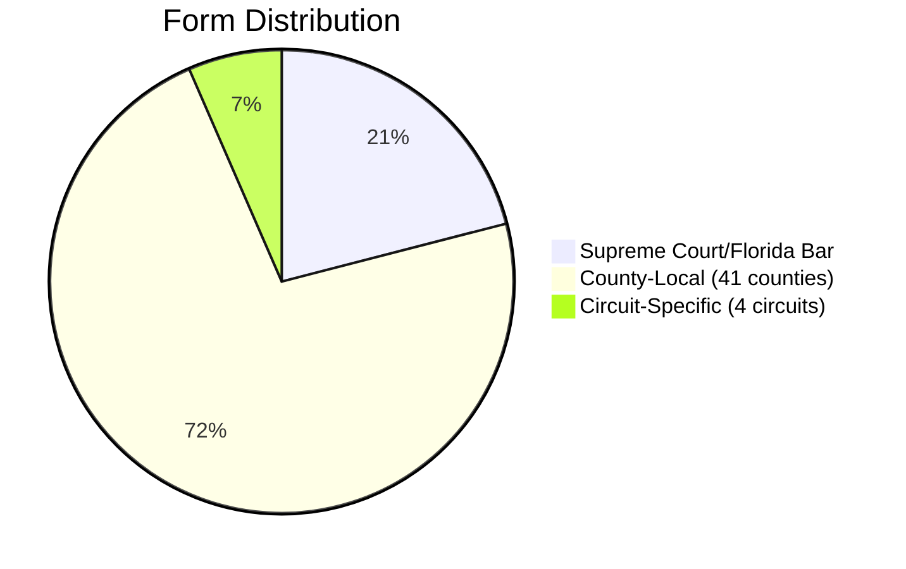

# ⚖️ LegalClear — Florida Pro Se Legal Information Platform

<p align="center">
  
</p>

<p align="center">
  <strong>Translate legal complexity into plain language. Surface the right forms. Never give legal advice.</strong>
</p>

<p align="center">
  <a href="https://legalclear.app"></a>
  <a href="https://github.com/joewpb/legalclear/blob/main/LICENSE"></a>
  <a href="#build-status"></a>
  <a href="#build-status"></a>
</p>

---

## What LegalClear Does

LegalClear is a legal-information platform for Floridians navigating the court system without a lawyer. A user uploads a document or asks a question — the platform classifies it, extracts deadlines, explains it in plain language, surfaces the correct court forms, and schedules reminders.

**It produces legal information, never legal advice.** It translates, surfaces options, and explains consequences. It never selects a course of action.

---

## Architecture



**Key architecture rule:** The backend is the security boundary. The client talks only to the Railway backend; the backend is the only component that talks to Supabase and holds the service-role key.

---

## How It Works — Document Pipeline



---

## Feature Modules



---

## Module Breakdown

| Module | What It Does | UPL Guardrail | Risk Scoring |
|--------|-------------|---------------|--------------|
| **Document Scanner** | Upload a PDF → classified, explained, deadlines extracted | ✅ All responses carry disclaimer | ✅ Flags high-risk documents for attorney review |
| **Small Claims Explainer** | $8K jurisdiction, filing procedures, hearing prep, common outcomes | "In most cases..." "Typically..." | ✅ |
| **Criminal Procedure** | FL criminal stages, plea deals, bond hearings, public defender role, FL Rule 3.220 | "Research on similar charges shows..." | ✅ |
| **Police Report Analyzer** | What charges mean, Miranda rights, probable cause, how reports are used in court | "Courts typically view..." | ✅ |
| **Discovery Motion** | FL Rule 3.220 obligations, Brady violations, Giglio issues, motion filing procedures | "FL Rule 3.220 requires..." | ✅ |
| **Property & Casualty** | FL 624.155 bad faith, premises liability, comparative negligence, settlement ranges | "In typical P&C cases..." | ✅ |
| **Small Claims Wizard** | Interactive interview → generate FL small claims forms | Generates information, not advice | — |
| **Eviction Defense** | Guided defense flow with 5-business-day urgency warnings | Timelines are informational | — |
| **Traffic Citation** | Interactive traffic ticket resolution wizard | — | — |
| **FL Case Law** | Search + explain Florida appellate decisions | — | — |

---

## Stack

| Layer | Technology | Notes |
|-------|-----------|-------|
| **Backend** | FastAPI (Python 3.12) | Port 8001. **Never 8000.** |
| **Frontend** | React + TypeScript + Vite | Port 3000 |
| **Mobile** | Expo / React Native | Planned |
| **Database** | Supabase Postgres 17 | `miedifclpqewnixxkahs` (us-west-2) |
| **AI** | Claude Sonnet 4.6 | All LLM calls go through Anthropic API |
| **Payments** | Stripe | `$35.00` Filing Packet product |
| **Deploy** | Railway | Backend: `zesty-delight`, Frontend: `appealing-victory` |
| **Packages** | `uv` only | Never pip, never pipx |
| **Forms** | 796 court forms | 41 counties, 4 circuits, stored in Supabase Storage |

---

## Directory Structure

```
legalclear/
├── backend/
│   ├── main.py                    # FastAPI app entry point
│   └── src/
│       ├── api/
│       │   ├── routes.py          # API router registration
│       │   └── routers/
│       │       ├── chat.py        # POST /api/chat/{module} — SSE streaming
│       │       ├── intake.py      # POST /api/intake — document classifier
│       │       ├── documents.py   # Document upload + analysis
│       │       ├── forms.py       # Form search + download
│       │       ├── packets.py     # Packet builder
│       │       └── reminders.py   # Deadline reminders
│       ├── agents/
│       │   ├── chat_expert.py     # 5 per-module system prompts + SSE
│       │   ├── triage_router.py   # Document type classifier
│       │   ├── scanner.py         # Document analysis pipeline
│       │   └── deadline/          # Deadline extraction (deterministic code)
│       ├── core/
│       │   ├── disclaimer.py      # UPL compliance — every response
│       │   ├── upl.py             # Unauthorized Practice of Law guardrail
│       │   ├── i18n.py            # en/es language support
│       │   ├── config.py          # Environment configuration
│       │   └── reminders.py       # Push + email reminder logic
│       ├── services/
│       │   ├── county_router.py   # 796 forms → correct county
│       │   ├── packet_builder.py  # Generate fillable PDF packets
│       │   ├── translation_layer.py # Legal-to-plain-English
│       │   └── pdfa_generator.py  # PDF/A archival output
│       └── ingestion/
│           ├── pdf_parser.py      # PDF extraction
│           ├── ocr.py             # OCR for scanned documents
│           └── text_cleaner.py    # Normalize extracted text
├── frontend/
│   ├── src/
│   │   ├── pages/                 # React page components
│   │   │   ├── Dashboard.tsx
│   │   │   ├── SmallClaims.tsx
│   │   │   ├── CriminalProcedure.tsx
│   │   │   ├── PoliceReport.tsx
│   │   │   ├── DiscoveryMotion.tsx
│   │   │   └── PropertyCasualty.tsx
│   │   ├── components/
│   │   │   └── ChatDrawer.tsx     # Modal chat — 5 messages, then $9.99 Stripe
│   │   ├── api.js                 # Backend API client
│   │   └── App.tsx                # Root component
│   └── package.json
├── forms/                         # County harvest tools + enriched data
│   └── enriched_forms.json        # 443 forms with AI-generated summaries
├── supabase/                      # Migration files
├── phases/
│   ├── BUILD_PLAN.md              # v2 phase sequence (10 phases)
│   └── LEDGER.md                  # v1 build state (24 phases complete)
├── AGENTS.md                      # Build instructions for AI agents
├── CLAUDE.md                      # Project context for Claude
└── INTEGRATION_SUMMARY.md         # County harvest integration (June 2026)
```

---

## UPL Guardrail — Every Response

```
"This is NOT legal advice. LegalClear provides legal information for educational
purposes. It does not create an attorney-client relationship. Court procedures,
filing fees, and rules change. Always verify with the official source."
```

**Third-person framing only.** Never "you should," "you must," or "you need to."
Frame as research: "In most cases...," "Typically in Florida...," "Research shows..."

---

## Form Coverage — 796 Forms Across 41 Counties



| Metric | Before Integration | After Integration |
|--------|-------------------|-------------------|
| Forms in database | 167 | **796** |
| PDFs in storage | 120 | **684** |
| Enriched (AI summaries) | 58 | **443** |
| Counties covered | 4 | **41** |
| Circuits | 4 | 4 |

---

## Build Status

| Version | Status | Phases | Deployed |
|---------|--------|--------|----------|
| **v1** | ✅ **SHIPPED** | 24 phases (0–23) | May 15, 2026 |
| **v2** | 🔨 **IN PROGRESS** | 10 phases (BUILD_PLAN.md) | Phase 0-1 complete |

**v1 includes:** Document scanner, deadline extraction, form matching, Small Claims wizard, Eviction defense, Traffic citation, FL Case Law lookup, all 5 explainer modules with chat, Stripe integration, Supabase RLS, push notifications.

**v2 adds:** County-aware form routing, enriched form summaries, attorney review queue, mobile app (Expo), Spanish language support, chat system for all modules, risk scoring.

---

## Getting Started

### Prerequisites
- Python 3.12+, Node.js 20+
- `uv` for Python packages
- Supabase project at `miedifclpqewnixxkahs`
- Anthropic API key
- Railway account (for deploy)

### Backend

```bash
cd backend
uv sync
uv run uvicorn main:app --host 0.0.0.0 --port 8001
```

### Frontend

```bash
cd frontend
npm install
npm run dev
```

### Test Chat

```bash
curl -X POST http://localhost:8001/api/chat/small_claims \
  -H "Content-Type: application/json" \
  -d '{"message":"What happens at a small claims hearing?","session_id":"test-1"}'
```

---

## Design Principles

1. **LLMs extract. Deterministic code computes.** No LLM does date arithmetic. Every deadline carries a full `computation_trace` with rule citations.
2. **"Unknown" is a valid output.** A confident wrong answer is a liability.
3. **Language-parameterized.** Every user-facing output accepts a language parameter. English ships first; Spanish requires no re-architecture.
4. **Never port 8000.** Port 8000 is reserved. Using it is a build failure.
5. **`uv` only.** Never pip, never pipx. One package manager, everywhere.
6. **Backend is the security boundary.** Frontend never talks directly to Supabase.

---

## Contributing

Read `AGENTS.md` for the full build discipline. Key rules:
- v1 phases are locked. Do not modify deployed v1 code.
- v2 phases execute one per session, in strict order.
- Every phase has a Definition of Done. All assertions must pass.
- Never run untested migrations against production.

---

## License

MIT © 2026 LegalClear

---

<p align="center">
  <sub>Built with ⚖️ in Florida. Never port 8000.</sub>
</p>
